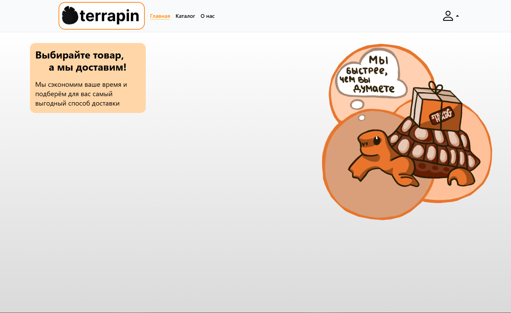
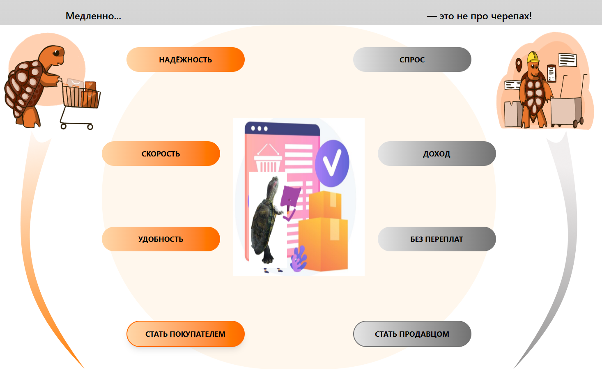
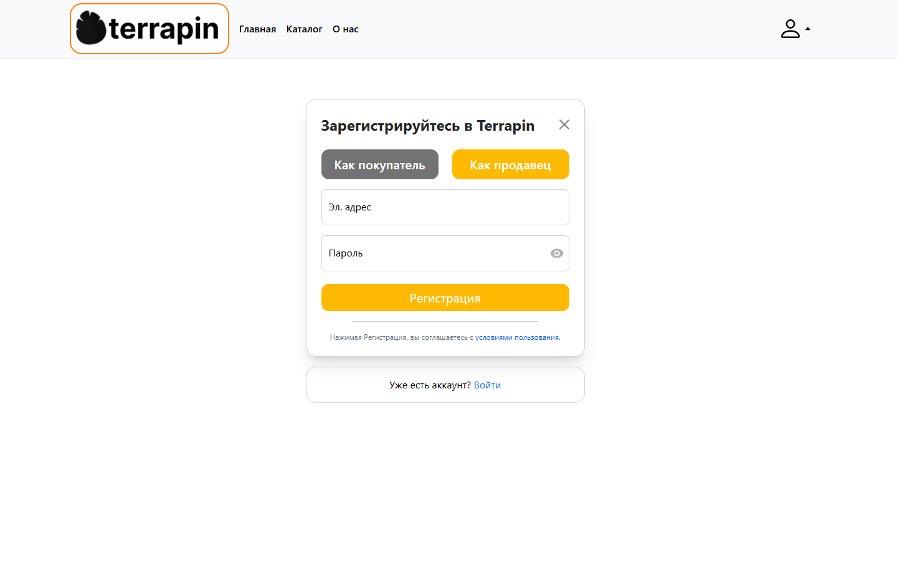
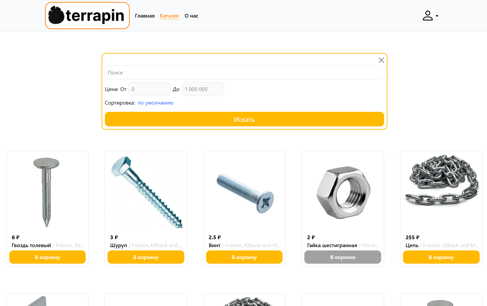
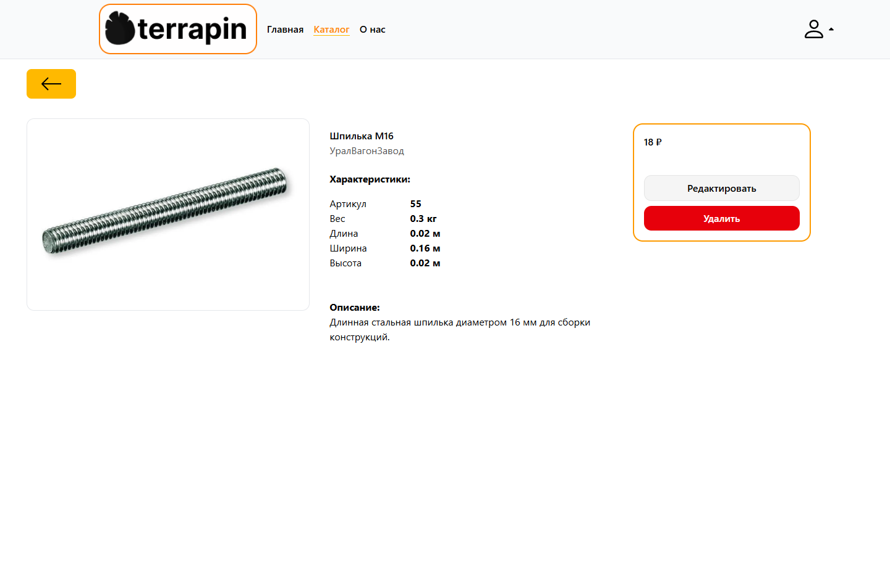
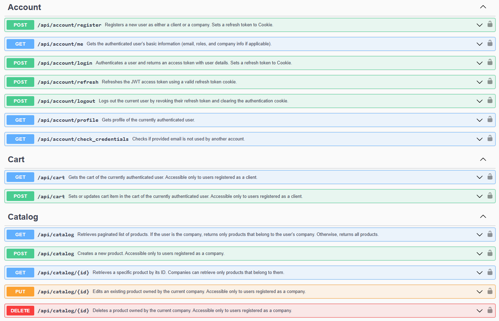
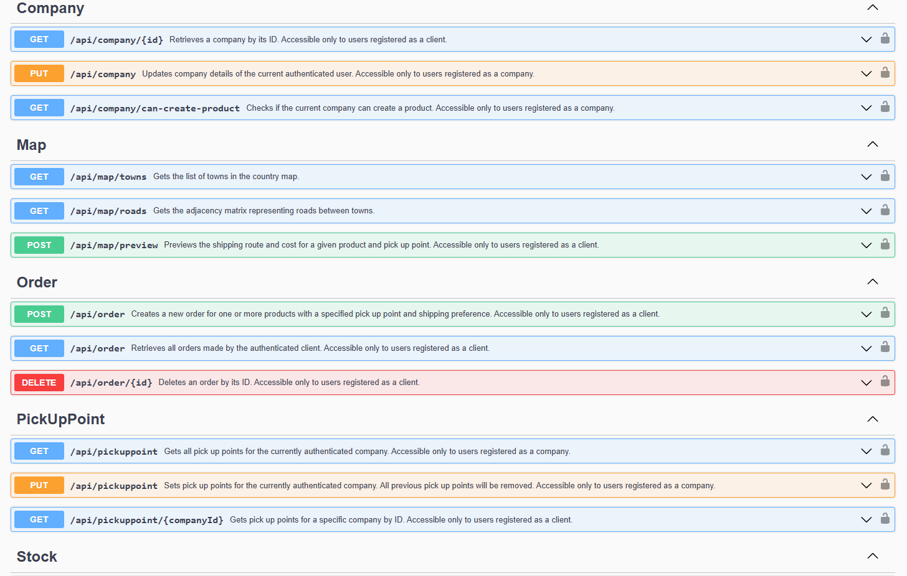

# DeliveryManagement
E-Commerce fullstack website with self-written Dijkstra's Algorithm for finding the best routes for shipping on an improvised city map.

This project was created for the CodeRock 2024 Hackathon and then modified as a personal project for learning.

The old legacy version that was using Razor pages instead of a separate frontend: [DeliveryManagement-Legacy](https://github.com/bottomtext228/DeliveryManagement-Legacy)


## Overview
The website supports two types of users - **clients** and **companies** - each with distinct functionality.

###  Clients
- Browse all **products** from all companies  
- Add items to **cart** and place **orders**  
- Choose a company’s pickup point for delivery  
- Select delivery route type: **cheapest** or **fastest**

### Companies
- Create and manage **products** (add, edit, delete)  
- Set up **stocks** and **pickup points** in towns  

The system calculates delivery options using a **self-written Dijkstra’s algorithm** implemented on the backend.


### Tech stack:
### Backend
- **C# ASP.NET Core**
- **Entity Framework Core**
- **Identity** for authentication & roles
- **JWT** for secure authorization
- **Swagger/OpenAPI** for API documentation

### Frontend
- **React (TypeScript)**
- **React Router** - routing
- **TanStack Query** - data fetching and caching
- **Zustand** - state management
- **Axios** - API communication
- **React Hook Form** - form validation
- **Tailwind CSS** - styling

## Launching

#### 1. Clone the repository and navigate to the project folder.

```
git clone https://github.com/bottomtext228/DeliveryManagement.git
cd DeliveryManagement
```

#### 2. Setup environment variables.

Supported variables:

- **DB_NAME** (Database name) **[Required]**

- **DB_USER** (Database user) **[Required]**

- **DB_PASSWORD** (Database password) **[Required]**

- **JWT_SECRET_KEY** (Signing key for JWT. Must be atleast 32 characters long) **[Required]**

- **SEED_TEST_DATA** (Should seed test data with companies, clients, products) *[Optional]*


The easiest way is to create `.env` file in the project folder and write variables there:
```
echo DB_NAME=db >> .env
echo DB_USER=postgres >> .env
echo DB_PASSWORD=postgres123 >> .env
echo JWT_SECRETKEY=c8befecfb208cf1c13a6444942ff22bf5d031359bc9af0ee06f9331bb749ae47 >> .env
echo SEED_TEST_DATA=true >> .env
```

#### 3. Setup test data (optional).

If you want to seed a database with test data for dozens of products, companies, and customers, then:

1. Set environment variable `SEED_TEST_DATA=true`

2. Copy the folder with images of test products to the mounted folder with static files:

Bash/Powershell:
```
mkdir -p ./.containers/backend/images/test
cp -r ./app/backend/backend/wwwroot/images/test/* ./.containers/backend/images/test/
```

Batch:
```
mkdir -p "./.containers/backend/images/test"
xcopy ".\app\backend\backend\wwwroot\images\test\*" ".\.containers\backend\images\test\"
```

If you don't copy the folder, then server will not be able to serve products images.

You can login to created client user using email `client@mail.com` and password `123123` and login to company user using email `company@mail.com` and password `123123`.

#### 3. Launch.

Run docker compose using:
```
docker compose up -d
```

The service will be available at `http://localhost`.


## Screenshots
Here a few screenshots of the project:

### Logotip page




### Register page


### Catalog page


### Product details page


### API Documentation (Swagger UI)



